# Шаг 1. Создание разметки

- [Шаг 1. Создание разметки](#шаг-1-создание-разметки)
  - [Семантика](#семантика)
  - [Первоначальная структура](#первоначальная-структура)
  - [Выделяем крупные смысловые блоки](#выделяем-крупные-смысловые-блоки)
  - [Выделяем в блоках смысловые разделы](#выделяем-в-блоках-смысловые-разделы)
  - [Задаём заголовки](#задаём-заголовки)
  - [Размечаем разделы](#размечаем-разделы)
    - [Шапка сайта](#шапка-сайта)
    - [Заглавный раздел](#заглавный-раздел)
    - [Раздел с преимуществами](#раздел-с-преимуществами)
    - [Раздел с популярными букетами](#раздел-с-популярными-букетами)
    - [Раздел с каталогом](#раздел-с-каталогом)
    - [Раздел со спецпредложением](#раздел-со-спецпредложением)
    - [Раздел с описанием процесса заказа](#раздел-с-описанием-процесса-заказа)
    - [Раздел с новостями](#раздел-с-новостями)
    - [Раздел с отзывами](#раздел-с-отзывами)
    - [Раздел с информацией о компании](#раздел-с-информацией-о-компании)
    - [Подвал сайта](#подвал-сайта)
  - [Заканчиваем разметку](#заканчиваем-разметку)
  - [Проверка](#проверка)

## Семантика
На этом этапе нам предстоит задать задать семантическую структуру документа. Что это такое и зачем это нужно хорошо разбирается в [этом докладе](https://www.youtube.com/watch?v=bDYEnNzprzE). Итак, приступим.

## Первоначальная структура
*Здесь и далее для удобства я буду использовать Emmet - утилиту, упрощающую и ускоряющую работу с html и css. Проще говоря, это набор сокращений, которые развёртываются в полноценные языковые конструкции. Список таких сокращений можно посмотреть [тут](https://docs.emmet.io/cheat-sheet/).*

Откроем ранее созданный файл `index.html`. На первой строке вводим `!` и жмём на `Tab` и получаем готовый каркас нашего html-документа.

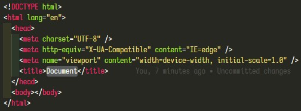

Поменяем `title`, возьмём текст из логотипа

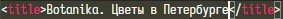

По умолчанию Emmet указывает английский в качестве языка страницы, поменяем на русский

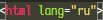

## Выделяем крупные смысловые блоки
Основа страницы задана, можем приступить непосредственно к написанию разметки.
Для начала определим самые крупные смысловые блоки страницы. Ими у нас будут шапка (`header`) - здесь размещаем введение к сайту, информацию, повторяющуюся на каждой странице (логотип, навигация, слоган, поле поиска по сайту); основная содержательная часть страницы (`main`); подвал (`footer`) - здесь мы размещаем дополнительную информацию, повторяющуюся на каждой странице (дополнительная навигация, копирайты, контакты и т.д.).

*Не стоит думать, что элементы `header` и `footer` предназначены исключительно для глобальных областей страницы. Они просто размечают вступительную и дополнительную информацию о контенте соответственно и могут входить в состав элементов `main`, `section`, `article`, `aside`.*

Разместим эти блоки на странице при помощи Emmet

## Выделяем в блоках смысловые разделы
Далее определяем в этих блоках крупные смысловые разделы, т.е. `nav`, `section`, `article` и `aside`. В элементе `nav` размещают ссылки навигации как на разделы текущего документа, так и на другие страницы. Навигацию можно считать вступительной информацией к сайту, поэтому размещаем этот элемент внутри `header`

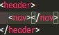

Изучив макет, определяем основные разделы в блоке `main` - заглавный раздел с информацией о деятельности компании, раздел с преимуществами, раздел с популярными букетами, раздел с категориями каталога, раздел со спецпредложением, раздел с описанием оформления заказа, раздел с новостями, раздел с отзывами о компании и раздел с информацией о компании. Перенесём все эти разделы в разметку, для удобства сразу назначим им классы и идентификаторы для навигации. Получим следующую структуру:

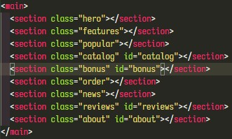

В элементе `footer` дублируется навигация по сайту. Так как есть [рекомендация от составителей спецификации](https://web-standards.ru/articles/avoiding-html5-mistakes/), что если навигация дублируется в двух местах — например, в шапке и в подвале — то в подвале можно её в `nav` не оборачивать.

## Задаём заголовки
На макете не заголовка первого уровня, поэтом добавим его самостоятельно и визуально скроем

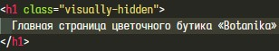

Добавляем заголовки разделов в соответствии с макетом. Разделы с преимуществами, каталогом и спецпредложениями по макету не имеют заголовка, поэтому добавляем их самостоятельно и визуально скрываем. Сейчас наша страница выглядит так

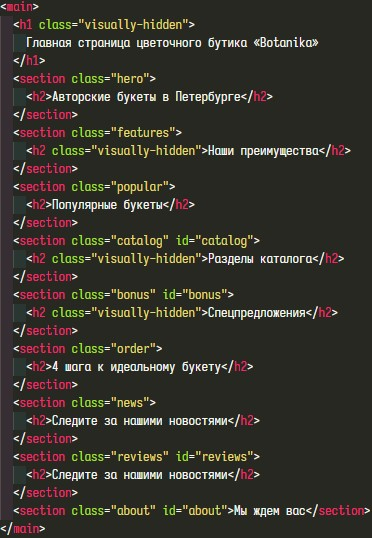

## Размечаем разделы

### Шапка сайта
Начнём с навигации в шапке. Разметим логотип сайта. Согласно обязательным требованиям [технического задания](https://docs.google.com/document/d/1UZQpZItCsK2jYSU7fWlNasmQHS-uAzeC87Qt80HKEtg/edit) логотип должен быть ссылкой на главную страницу, поэтому обернём его в `a`

и расставим необходимые атрибуты

Навигация - это список ссылок, которые можно располагать в любом порядке, поэтому для его разметки используем неупорядоченный список `ul`, вводим `ul>li*6>a` и заполняем атрибуты и текст ссылок. Шапка сайта приобретает следующий вид

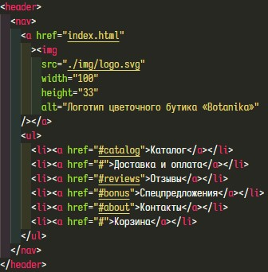

### Заглавный раздел
Добавляем параграф с информацией о деятельности компании, ссылку на каталог и изображения букетов, которые показывают, что компания предлагает. Изображения однородные, поэтому делаем их элементами неупорядоченного списка. Вводим `p+a{Смотреть каталог}+ul>li*2>img` и заполняем атрибуты и текст

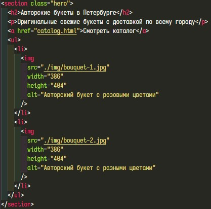

### Раздел с преимуществами
Данный раздел состоит из трёх одинаковых блоков, состоящих из заголовка с наименованием преимущества и текстом, описывающим это преимущество. Изображения не играют никакой роли, мы можем их удалить, смысл блока от этого не изменится, поэтому добавим их на следующих этапах с помощью стилей. Так как все блоки в этом разделе одинаковые и могут быть расположены в любом порядке, то делаем их элементами неупорядоченного списка. Вводим `ul>li*3>h3+p` и вставляем текст из макета

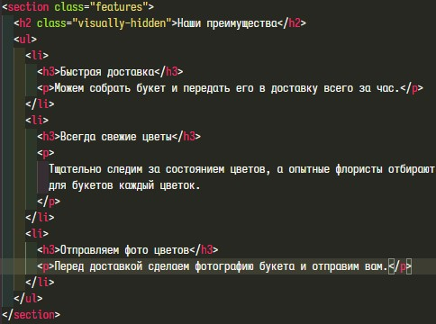

### Раздел с популярными букетами
Данный раздел подразумевает использование слайдера для прокрутки популярных букетов и хотя в [техническом задании](https://docs.google.com/document/d/1UZQpZItCsK2jYSU7fWlNasmQHS-uAzeC87Qt80HKEtg/edit#heading=h.n318s0es3uz9) говорится о том, что реализовывать слайдер не нужно, тем не менее разметку будем делать с учётом использования слайдера. В карточке слайда расположим заголовок с названием букета, описание этого букета, его размер, цену, ссылку на страницу заказа и его изображение. Так как слайдов может быть несколько и они прокручиваются в любом порядке, то используем наш привычный неупорядоченный список. Вводим `ul>li>h3+p*3+a+img` и заполняем атрибуты ссылки и изображения, а также вставляем текст из макета. Остаётся добавить кнопки управления слайдером - `btn*2>span.visually-hidden`

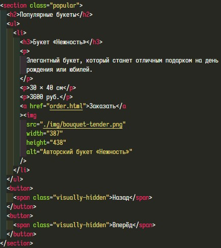

### Раздел с каталогом
Здесь у нас по [техзаданию](https://docs.google.com/document/d/1UZQpZItCsK2jYSU7fWlNasmQHS-uAzeC87Qt80HKEtg/edit) список карточек, которые являются ссылками на страницу каталога. Со списком всё понятно, вопрос как оформить карточку. Тут возможны два варианта - либо это текстовый блок с фоновой картинкой, либо это изображение с подписью, иллюстрирующее содержимое соответствующего раздела каталога. Мне более симпатичен второй вариант, поэтому реализуем его. Для изображений с подписью есть специальный элемент `figure`. Таким образом структура карточки получается такой - `figure` с изображением, в нём `figcaption` с подписью и всё это обёрнуто в ссылку. Вводим `ul>li*3>a>figure>img+figc>h3+p` и, как обычно, заполняем атрибуты и вставляем текст из макета.

### Раздел со спецпредложением
Здесь всё просто - текстовый блок и блок с фоновым изображением, которое мы добавим позже. Вводим `h3+p` и вставляем текст из макета.

### Раздел с описанием процесса заказа
В этом разделе у нас снова список однотипных элементов, схожий со списком в разделе преимуществ. Но есть важное отличие - в этом списке порядок элементов играет важную роль, не получится переставить элементы и сохранить смысл. Поэтому в этот раз будем использовать упорядоченный список. Вводим `ol>li*4>h3+p` и вставляем текст из макета.

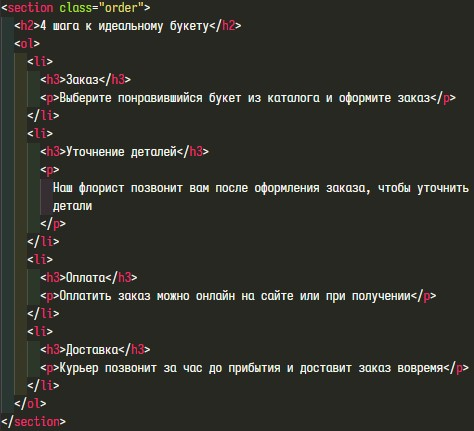

### Раздел с новостями
В этом разделе можно увидеть текстовый блок, список ссылок на соцсети и блок с превью постов в социальных сетях. Перенесём всё это в вёрстку, вводим `p+(ul>li*3>a>span.visually-hidden)+img*3`, задаём атрибуты и вставляем текст из макета.

### Раздел с отзывами
Здесь у нас очередной неупорядоченный список однотипных элементов. Так как отзыв - это по сути цитата, то используем соответствующий элемент `blockquote`, автора выделим при помощи элемента `cite`. Вводим `ul>li*3>blockquote>p+cite` и вставляем текст из макета.

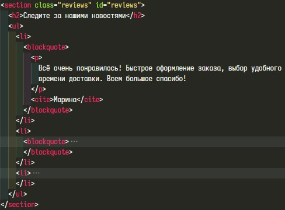

### Раздел с информацией о компании
В этом разделе мы видим текстовый блок с информацией о компании, а также карту с расположением компании. Определим, чем же является карта. Внимательно её изучив, мы видим справа элементы управления, а также замечаем, что самого дома, указанного в адресе компании, на карте нет. Очевидно, что такая карта никак не может быть контентным изображением. Позже мы сделаем её фоновым изображением данного раздела, для того, чтобы она служила резервом на случай если не прогрузится интерактивная карта. Информация же кажется похожей на таблицу, однако логичнее представить её как список определений, т.е. термин "Приходите к нам" мы определяем значением адреса и т.д. Вводим `dl>(dt+dd)*3` и вставляем текст из макета. Телефон и почту оформляем в виде ссылок.

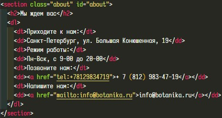

### Подвал сайта
Здесь у нас дублируется навигационное меню и ссылки на социальные сети, поэтому просто копируем и вставляем соответствующие элементы.

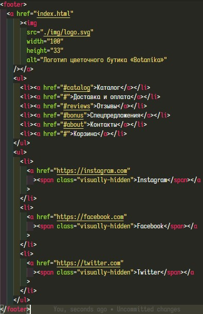

## Заканчиваем разметку
Внимательно сверяемся с макетом и вносим последний штрих - в заголовке заглавного раздела обернём слова "в Петербурге" элементом `em`, потому что тут именно смысловое выделение - букеты создаются и продаются в Петербурге.

## Проверка
Выделяем и копируем всё содержимое файла `index.html`, переходим на [сайт валидатора](https://validator.w3.org/#validate_by_input), вставляем скопированный код в текстовое поле и жмём кнопку "Check". Убеждаемся в том, что не допустили ошибок в разметке страницы.

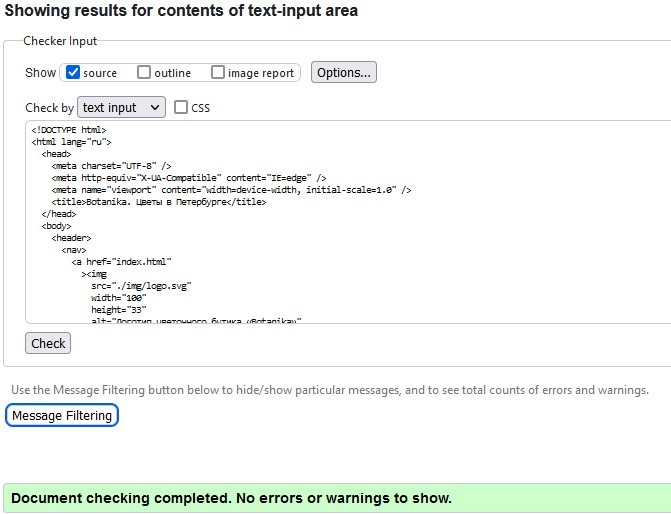

Сверяемся с [критериями](https://docs.google.com/document/d/1fIqqTw3IjezXCrmIDI5dGbH6bGNhVlTlEU6GZcL6m9U/edit):

✅ Б1

✅ Б4

✅ Б5

✅ Б15

✅ Б16

✅ Б17

✅ Д1

✅ Д2

✅ Д3

Остаётся зафикировать все изменения и синхронизировать код с удалённым репозиторием. Добавляем все изменения - `git add -A`, фиксируем и обозначаем изменения - `git commit -m "feat: add page basic layout"` и отправляем изменения - `git push`.

*Исходный код данного этапа находится [тут](./step-1/)*