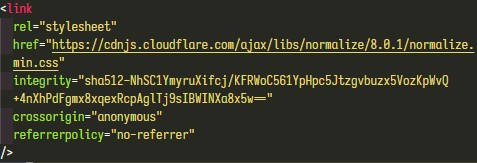
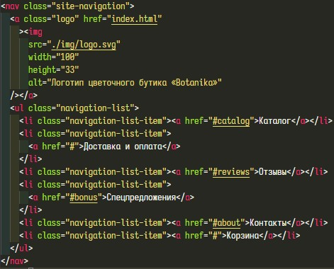
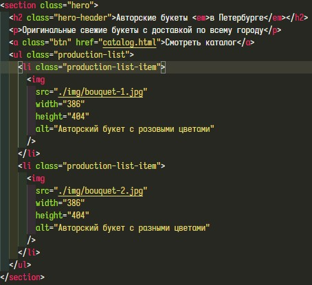
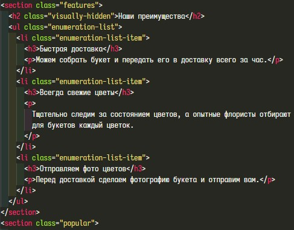
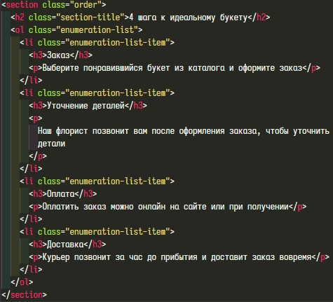
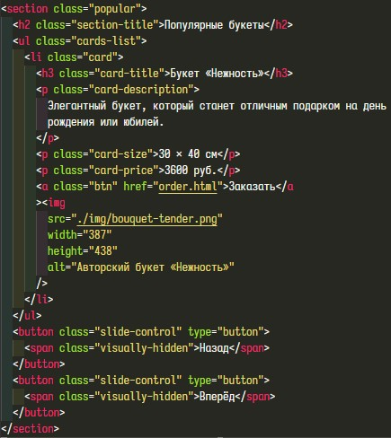

# Базовая стилизация

На этом шаге мы сбросим стили, установленные по умолчанию, назначим классы элементам в разметке, подключим шрифты и стилизуем текстовые элементы.

## Сброс стилей

Что такое сброс стилей, зачем его делать, как его делать, что такое normalize.css - всё это разбирается в [этой статье](https://habr.com/ru/company/htmlacademy/blog/342052/). Мы же просто подключим этот файл. Перед нами два пути - либо идём в [репозиторий проекта](https://necolas.github.io/normalize.css/8.0.1/normalize.css) и сохраняем файл в нашу папку /styles, либо используем [CDN](https://cdnjs.com/libraries/normalize). Мы пойдём вторым путём, подключим минифицированный файл. Все файлы стилей подключаются в секции `head`.

## Назначение классов

Зачем нужны классы? Классы позволяют CSS и JavaScript выбирать и получать доступ к HTML элементам для взаимодействия с ними. Находим однообразные элементы и назначаем им общий класс для того, в результате мы задаём стили для одного класса, а не для каждого из этих однообразных элементов.

Начнём с шапки. Здесь у нас навигационное меню, дадим ему класс "site-navigation". Логотипу зададим класс "logo", списку навигационных ссылок зададим "navigation-list", элементам списка - "navigation-list-item".

Дальше идёт заглавный раздел. Классы самим разделам мы задали на прошлых шагах. Стиль заголовка заглавного раздела не повторяется больше нигде, поэтому в названии класса подчеркнём, что это заголовок именно этого раздела - "hero-header".
Текстовые параграфы оформлены одинаково почти в каждом разделе, поэтому не будем назначать им отдельный класс, а оформим сразу для всего сайта.
Ссылка "Смотреть каталог" заглавного раздела и ссылка "Заказать" раздела с популярными букетами одинаковы, поэтому зададим каждой из них один класс "btn".
Списку изображений зададим класс "production-list", его элементам - "production-list-item".

Переходим в раздел с преимуществами. Видимые заголовки разделов выполнены в едином стиле, зададим каждому класс "section-title".
Можно заметить, что данный раздел и раздел с описанием процесса оформления заказа имеют одинаковое оформление, поэтому для обоих зададим одинаковые классы. Для списка - "enumeration-list", для его элементов - "enumeration-list-item".

Следующий раздел "Популярные букеты". Списку слайдов зададим класс "cards-list", самому слайду - "card". Заголовку слайда - "card-title", описанию - "card-description", размерам - "card-size" и цене - "card-price".
Кнопкам прокрутки слайдов зададим класс "slide-control".

