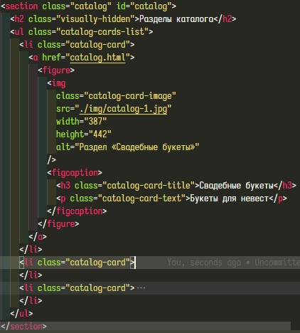
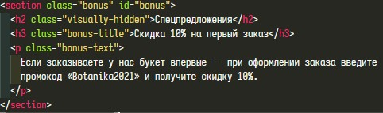
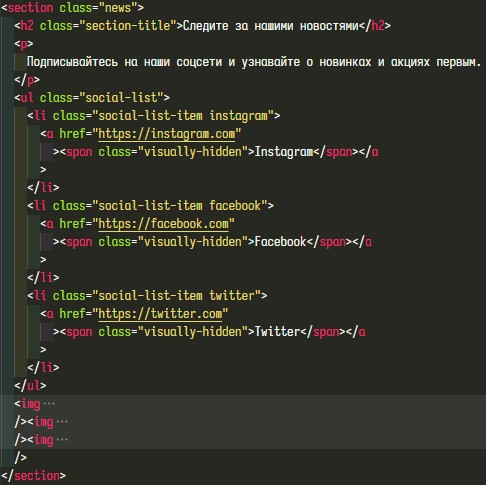
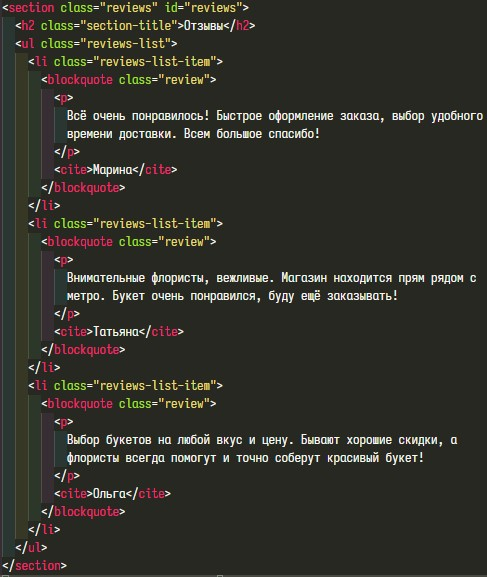
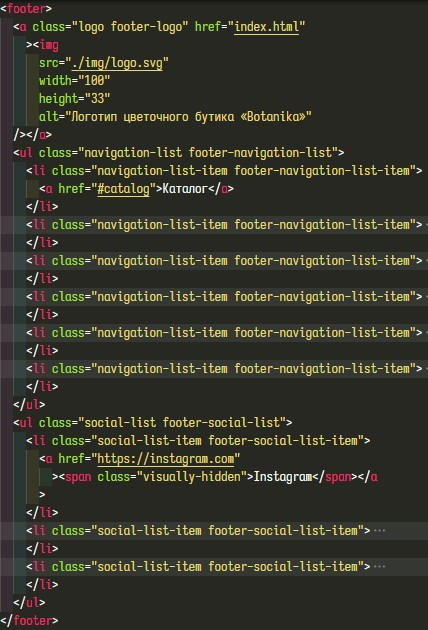
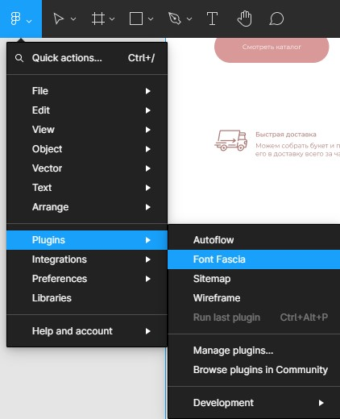
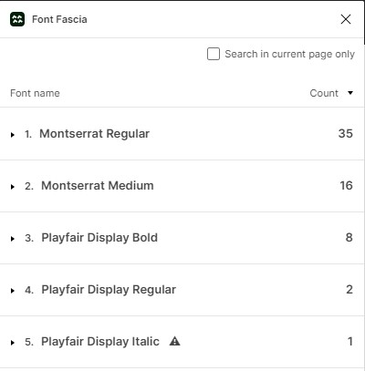
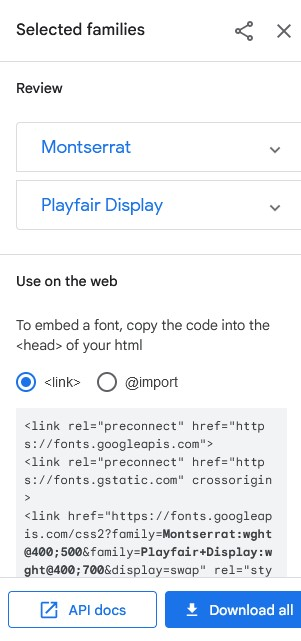
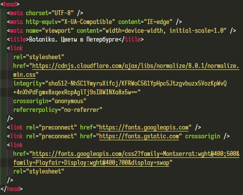

# Базовая стилизация

- [Базовая стилизация](#базовая-стилизация)
  - [Подготовка](#подготовка)
  - [Сброс стилей](#сброс-стилей)
  - [Назначение классов](#назначение-классов)
  - [Подключение шрифтов](#подключение-шрифтов)

На этом шаге мы сбросим стили, установленные по умолчанию, назначим классы элементам в разметке, подключим шрифты и стилизуем текстовые элементы.

## Подготовка

Примем всё сделанное на прошлых шагах за базовую контрольную точку. Все последующие шаги будем выполнять в отдельных ветках и при успешном завершении шага будем сливать эти ветки с основной веткой репозитория. Создаём и сразу переключаемся на новую ветку - в командной строке вводим `git checkout -b "base style"`.

## Сброс стилей

Что такое сброс стилей, зачем его делать, как его делать, что такое normalize.css - всё это разбирается в [этой статье](https://habr.com/ru/company/htmlacademy/blog/342052/). Мы же просто подключим этот файл. Перед нами два пути - либо идём в [репозиторий проекта](https://necolas.github.io/normalize.css/8.0.1/normalize.css) и сохраняем файл в нашу папку /styles, либо используем [CDN](https://cdnjs.com/libraries/normalize). Мы пойдём вторым путём, подключим минифицированный файл. Все файлы стилей подключаются в секции `head`.

## Назначение классов

Зачем нужны классы? Классы позволяют CSS и JavaScript выбирать и получать доступ к HTML элементам для взаимодействия с ними. Находим однообразные элементы и назначаем им общий класс для того, в результате мы задаём стили для одного класса, а не для каждого из этих однообразных элементов.

Начнём с шапки. Здесь у нас навигационное меню, дадим ему класс "site-navigation". Логотипу зададим класс "logo", списку навигационных ссылок зададим "navigation-list", элементам списка - "navigation-list-item".

Дальше идёт заглавный раздел. Классы самим разделам мы задали на прошлых шагах. Стиль заголовка заглавного раздела не повторяется больше нигде, поэтому в названии класса подчеркнём, что это заголовок именно этого раздела - "hero-header".
Текстовые параграфы оформлены одинаково почти в каждом разделе, поэтому не будем назначать им отдельный класс, а оформим сразу для всего сайта.
Ссылка "Смотреть каталог" заглавного раздела и ссылка "Заказать" раздела с популярными букетами одинаковы, поэтому зададим каждой из них один класс "btn".
Списку изображений зададим класс "production-list", его элементам - "production-list-item".

Переходим в раздел с преимуществами. Видимые заголовки разделов выполнены в едином стиле, зададим каждому класс "section-title".
Можно заметить, что данный раздел и раздел с описанием процесса оформления заказа имеют одинаковое оформление, поэтому для обоих зададим одинаковые классы. Для списка - "enumeration-list", для его элементов - "enumeration-list-item".

Следующий раздел "Популярные букеты". Списку слайдов зададим класс "cards-list", самому слайду - "card". Заголовку слайда - "card-title", описанию - "card-description", размерам - "card-size" и цене - "card-price".
Кнопкам прокрутки слайдов зададим класс "slide-control".

Раздел каталога. Списку присваиваем класс "catalog-cards-list", элементам - "catalog-card", изображению - "catalog-card-image", заголовку - "catalog-card-title", тексту - "catalog-card-text".

Раздел спецпредложения. Заголовок самого спецпредложения оформлен не так как все, присваиваем ему класс "bonus-title", текст спецпредложения имеет общее оформление, отличается только цвет, поэтому присвоим свой класс и ему - "bonus-text".

Разделу с описанием оформления заказа мы задали классы вместе с разделом преимуществ.

В разделе с новостями зададим класс списку ссылок на соцсети - "social-list" и самим элементам списка - "social-list-item". Для удобства каждому дополнительно зададим собственный класс.

Переходим в раздел с отзывами. Списку отзывов задаём "reviews-list", элементам - "reviews-list-item", отзыву - "review".

В разделе с информацией о компании зададим класс списку - "about-list".

Остаётся подвал сайта. Логотип, список навигационных ссылок и список ссылок на соцсети нам уже встречались, поэтому зададим им те же классы. Отличием будет только цвет шрифта, поэтому добавим дополнительные классы, чтобы подчеркнуть это.

## Подключение шрифтов

Для начала необходимо определить какие шрифты используются в макете. В этом нам поможет дополнение [Font Fascia](https://www.figma.com/community/plugin/746097413727734148/Font-Fascia). Запускаем

Перед нами информация обо всех шрифтах, используемых в макете

Переходим в [Google Fonts](https://fonts.google.com/), в поле поиска вбиваем имя шрифта, жмём на найденный шрифт и выбираем нужное начертание. В случае с "Montserrat" нам нужны Regular и Medium. Напротив каждого жмём "+ Select this style". Возвращаемся на главную страницу и в поле поиска вбиваем имя следующего шрифта, в нашем случае это "Playfair Display", выбираем Regular и Bold. Копируем сформированные ссылки

и вставляем их в секцию `head` после подключения normalize.css.

