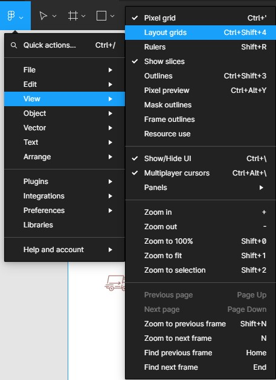
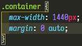
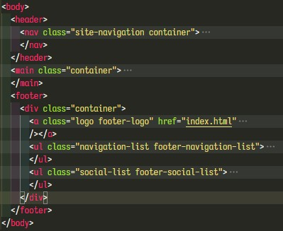

# Сетки

На этом этапе нам предстоит создать сетку по макету и расположить на ней все элементы.

## Подготовка

Снова создадим новую ветку - `git checkout -b "grids"`.
Включим в Figma отображение сетки через меню, либо при помощи комбинация Ctrl+Shift+4

## Создание контейнера

Создадим контейнер с шириной, равной ширине макета и выровняем его по центру страницы. Открываем наш файл со стилями и добавляем

По техническому заданию "Контентная область центрируется и не может быть уже макетной ширины. Фоны, которые упираются в края макета, должны тянуться на всю страницу." Таких блоков у нас два - шапка и подвал. Учитывая это, назначим созданный класс container крупным блокам.
Так как горизонтальные границы шапки должны тянуться на всю страницу, то класс добавим не элементу `header`, а элементу `nav`.
С главный содержимым всё просто - назначаем класс container элементу `main`.
Фон подвала сайта тоже должен тянуться на всю страницу, поэтому мы не можем назначить класс контейнера элементу `footer`. Создадим новый блок, который сгруппирует в себе все элементы подвала. Для этой цели идеально подходит `div`.

Весь контент нашего сайта отцентрован.